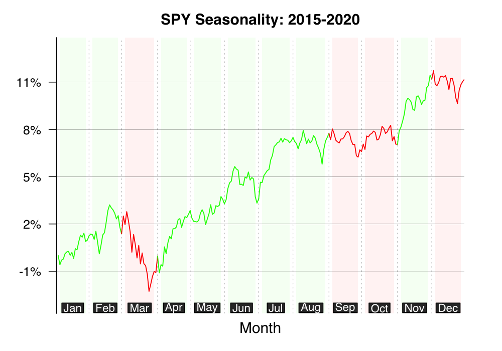

# [seasonalityPlot package (version 0.99.1)](https://github.com/kumeS/seasonalityPlot)

R package for Creating Seasonality Plots of Stock Prices and Cryptocurrencies

[GitHub/seasonalityPlot](https://kumes.github.io/seasonalityPlot/), 

# Version

0.99.1: Newly Published the GitHub.

# Installation

- install the latest from GitHub

type the code below in the R console window

```r
install.packages("devtools", repos="http://cran.r-project.org")
library(devtools)
devtools::install_github("kumeS/seasonalityPlot")
```

or install from the source file with `sh` commands

```sh
git clone https://github.com/kumeS/seasonalityPlot
R CMD INSTALL seasonalityPlot
```

# Function

- seasonPlot: create seasonality plot for stock prices or cryptocurrencies

# Usage of seasonPlot function

```r
library(seasonalityPlot)

#Plot by SPY
seasonPlot(Symbols="SPY", StartYear = 2015, EndYear = 2020)
```

<div style="text-align: center">
  
</div>


# License

Copyright (c) 2021 Satoshi Kume 

Released under the [Artistic License 2.0](http://www.perlfoundation.org/artistic_license_2_0).

# Authors

- Satoshi Kume


