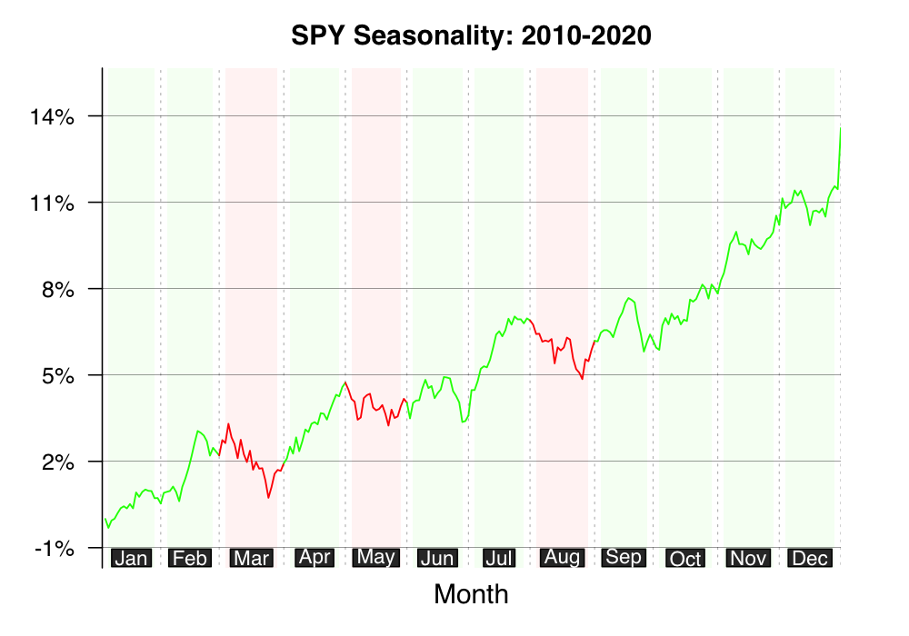
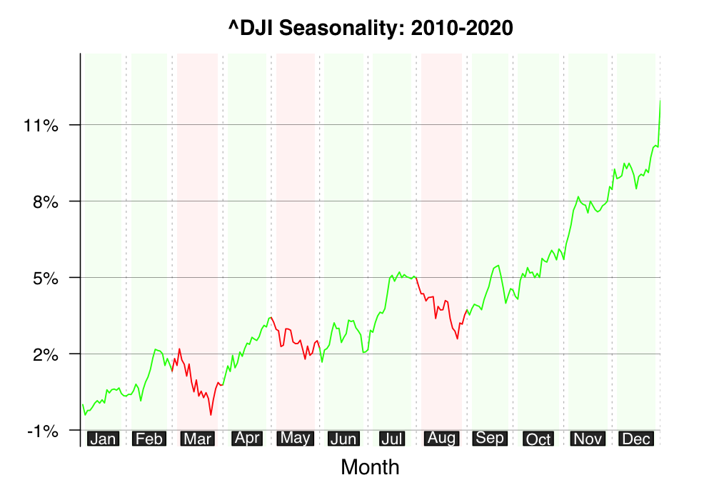
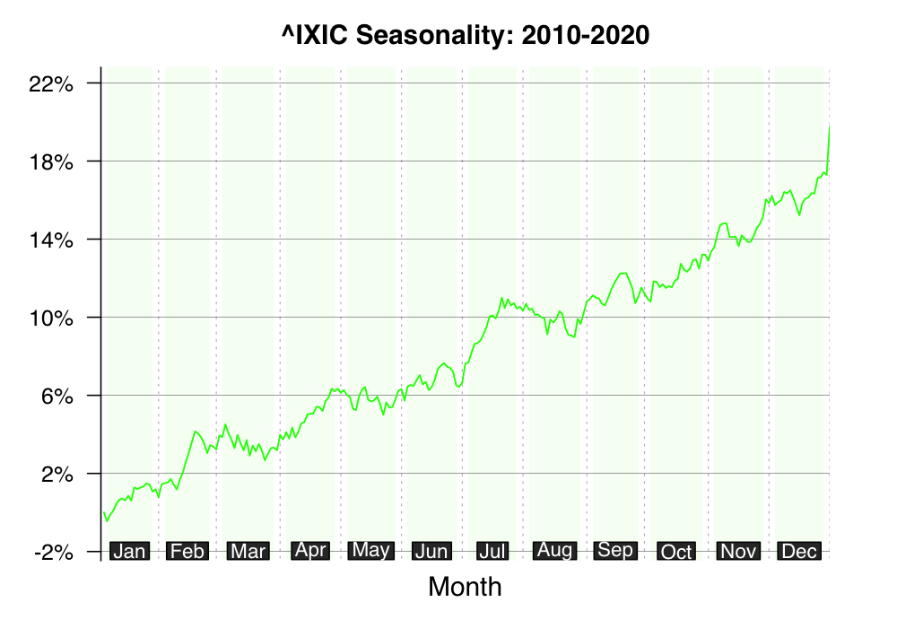
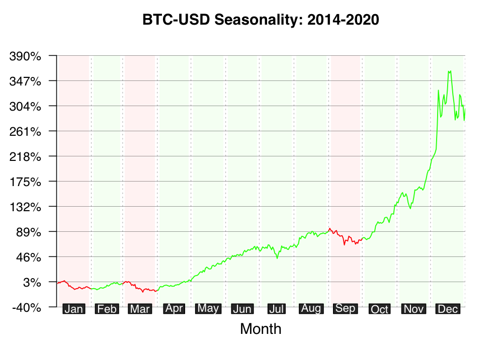
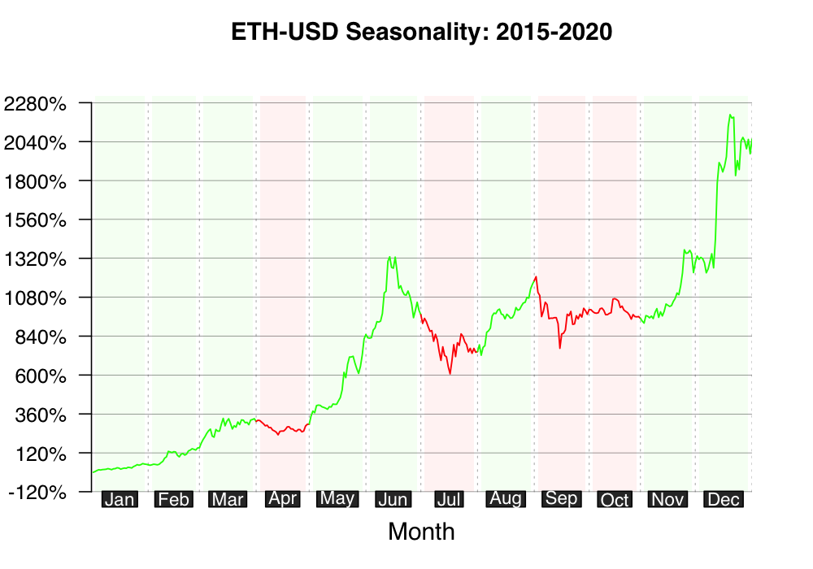

# [seasonalityPlot package (version 0.99.3)](https://github.com/kumeS/seasonalityPlot)

[](https://github.com/stevecondylios/rawr)

R package for Creating Seasonality Plots of Stock Prices and Cryptocurrencies

[GitHub/seasonalityPlot](https://kumes.github.io/seasonalityPlot/)

# Version

0.99.2: CRAN version.

0.99.1: Newly Published the GitHub.

# Installation

### install the latest from GitHub

type the code below in the R console window

```r
install.packages("devtools", repos="http://cran.r-project.org")
library(devtools)
devtools::install_github("kumeS/seasonalityPlot")
```

or install from the source file with `sh` commands

```sh
git clone https://github.com/kumeS/seasonalityPlot.git
R CMD INSTALL seasonalityPlot
```

# Function

- seasonPlot: create seasonality plots for stock prices or cryptocurrencies

# Usage of seasonPlot function

```r
library(seasonalityPlot)

#Plot an averaging seasonality of SPDR S&P500 ETF (SPY) between 2010 and 2020.
seasonPlot(Symbols="SPY")
```

<div style="text-align: center">
  
</div>

```r
#Plot an averaging seasonality of Dow Jones Industrial Average (^DJI) between 2010 and 2020.
seasonPlot(Symbols="^DJI")
```

<div style="text-align: center">
  
</div>

```r
#Plot an averaging seasonality of NASDAQ Composite (^IXIC) between 2010 and 2020.
seasonPlot(Symbols="^IXIC")
```

<div style="text-align: center">
  
</div>

```r
#Plot an averaging seasonality of Bitcoin (BTC-USD) between 2014 and 2020.
seasonPlot(Symbols="BTC-USD")
```

<div style="text-align: center">
  
</div>

```r
#Plot an averaging seasonality of Ethereum (ETH-USD) between 2015 and 2020.
seasonPlot(Symbols="ETH-USD")
```

<div style="text-align: center">
  
</div>

# License

Copyright (c) 2021 Satoshi Kume 

Released under the [Artistic License 2.0](http://www.perlfoundation.org/artistic_license_2_0).

# Authors

- Satoshi Kume


