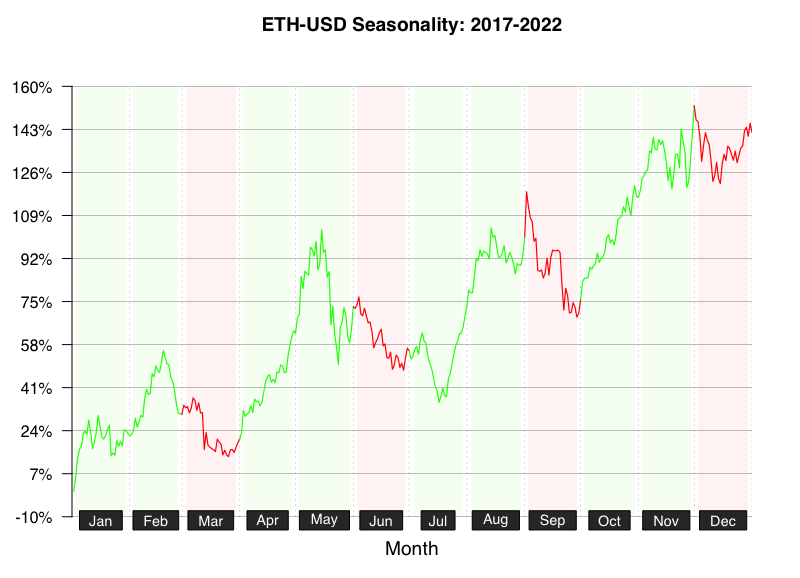

# [seasonalityPlot package](https://github.com/kumeS/seasonalityPlot)
 

[](https://CRAN.R-project.org/package=seasonalityPlot)
[](https://cran.r-project.org/package=seasonalityPlot)
[](https://www.datasciencemeta.com/rpackages)
[](https://cran.r-project.org/package=seasonalityPlot)
[](https://cranlogs.r-pkg.org:443/badges/last-week/seasonalityPlot)

R package for Creating Seasonality Plots of Stock Prices and Cryptocurrencies

# Description

The price action at any given time is determined by investor sentiment and market conditions. Although there is no established principle, over a long period of time, things often move with a certain periodicity. This is sometimes referred to as anomaly. The seasonPlot() function in this package calculates and visualizes the average value of price movements over a year for any given period. In addition, the monthly increase or decrease in price movement is represented with a colored background. This seasonPlot() function can use the same symbols as the 'quantmod' package (e.g. ^IXIC, ^DJI, SPY, BTC-USD, and ETH-USD etc).

## Documents and Web API

- [GitHub.io/seasonalityPlot](https://kumes.github.io/seasonalityPlot/)

- [Huggingface Spaces/seasonalityPlot API via Plumber](https://skume-seasonalityplot.hf.space/__docs__/#/)

# Version

1.3.1: Modify the "CryptoRSIheatmap" function (CRAN 4th version) and build the seasonalityPlot Web API on Huggingface Spaces.

1.2.1: Update seasonPlot & Add new function "CryptoRSIheatmap".

1.1.1: Update Figures.

1.1.0: CRAN 3rd version.

1.0.1: CRAN 2nd version.

0.99.3: CRAN version.

0.99.1: Newly Published the GitHub.

# Installation

### install from CRAN

```r
install.packages("seasonalityPlot", repos="http://cran.r-project.org")
```

### install the latest from GitHub

type the code below in the R console window

```r
install.packages("devtools", repos="http://cran.r-project.org")
library(devtools)
devtools::install_github("kumeS/seasonalityPlot")
```

or install from the source file with `sh` commands

```sh
git clone https://github.com/kumeS/seasonalityPlot.git
R CMD INSTALL seasonalityPlot
```

# Function

- seasonPlot: create seasonality plots for stock prices or cryptocurrencies

- CryptoRSIheatmap: CryptoRSI Heatmap Function

# Usage of seasonPlot function

```r
library(seasonalityPlot)

#Plot an averaging seasonality of SPDR S&P500 ETF (SPY) between 2012 and 2022.
seasonPlot(Symbols="SPY")

#useAdjusted = TRUE
seasonPlot(Symbols="SPY", useAdjusted = TRUE)
```

<div style="text-align: center">
  
</div>

```r
#Plot an averaging seasonality of Dow Jones Industrial Average (^DJI) between 2012 and 2022.
seasonPlot(Symbols="^DJI")
```

<div style="text-align: center">
  
</div>

```r
#Plot an averaging seasonality of NASDAQ Composite (^IXIC) between 2012 and 2022.
seasonPlot(Symbols="^IXIC")
```

<div style="text-align: center">
  
</div>

```r
#Plot an averaging seasonality of Bitcoin (BTC-USD) between 2017 and 2022.
seasonPlot(Symbols="BTC-USD")
```

<div style="text-align: center">
  
</div>

```r
#Plot an averaging seasonality of Ethereum (ETH-USD) between 2017 and 2022.
seasonPlot(Symbols="ETH-USD")
```

<div style="text-align: center">
  
</div>

```r
#CryptoRSI Heatmap Function provides a heatmap visualization of RSI values for a specified number of cryptocurrencies.

CryptoRSIheatmap(coin_num = 200, useRank = 1000, n = 21, useRankPlot = TRUE, OutputData = FALSE)
```

<div style="text-align: center">
  
</div>

# License

Copyright (c) 2021 Satoshi Kume 

Released under the [Artistic License 2.0](http://www.perlfoundation.org/artistic_license_2_0).

# Authors

- Satoshi Kume


